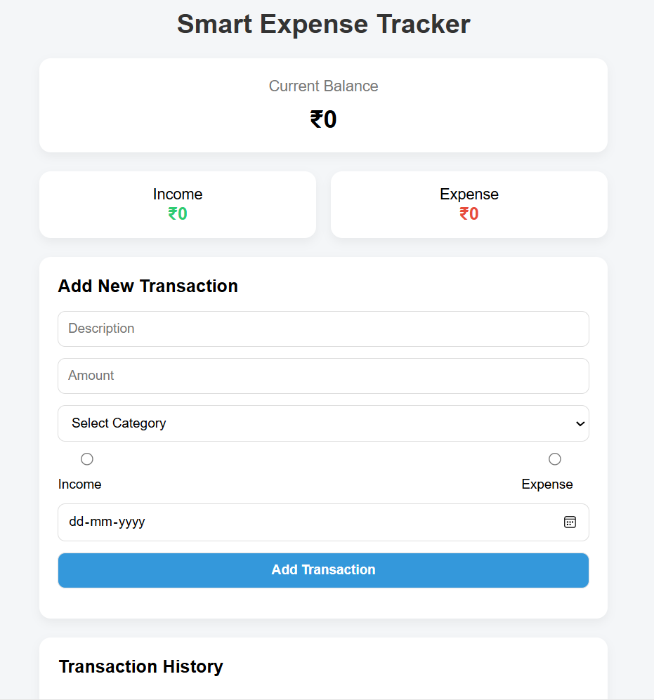
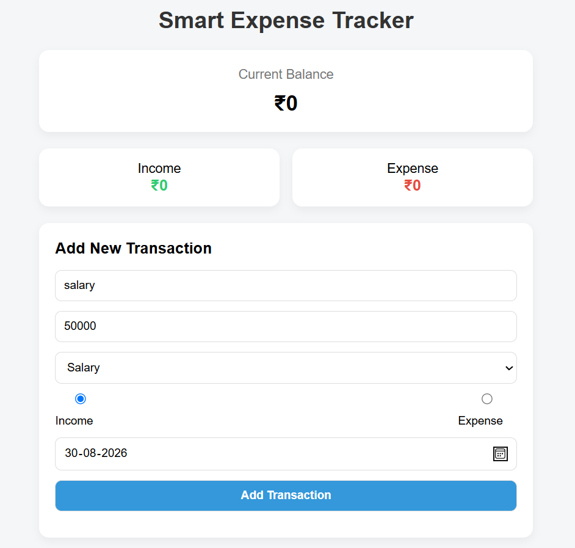
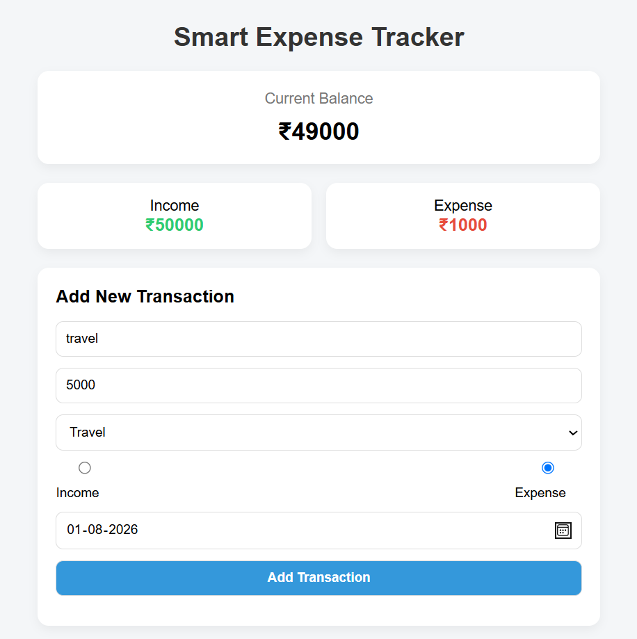
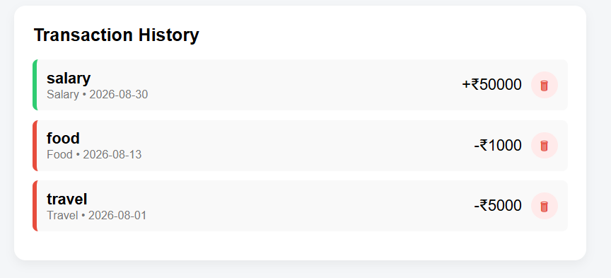

# 💰 Smart Expense Tracker

A responsive expense tracking web application built using **HTML**, **CSS**, and **JavaScript**. The application allows users to manage income and expenses, calculate their current balance in real time, and securely save transaction data using **Local Storage**.

---
## 🌐 Live Demo

🔗 **https://mannyusha.github.io/Smart-Expense-Tracker/**

## ✨ Features

- ➕ Add income and expense transactions
- 💰 Real-time balance calculation
- 📊 Separate income and expense summaries
- 🗂️ Category-based transaction management
- 🗑️ Delete transactions
- 💾 Data persistence using Local Storage
- 📅 Transaction history
- 📱 Responsive user interface

---

## 🎯 Learning Outcomes

Through this project I strengthened my understanding of:

- DOM Manipulation
- Event Handling
- Local Storage
- JavaScript ES6
- Responsive Web Design
- Dynamic UI Updates

## 🛠️ Technologies Used

- HTML5
- CSS3
- JavaScript (ES6)
- Local Storage

---

## 📸 Screenshots

### Home Page

### Adding Transactions

### Transaction History

---

## 🚀 Future Improvements

- ✏️ Edit transactions
- 📈 Charts and analytics
- 🔍 Search and filter transactions
- 📄 Export reports to PDF or Excel

---

## 👩‍💻 Author

**K. Mannyusha Reddy**

GitHub: https://github.com/mannyusha
